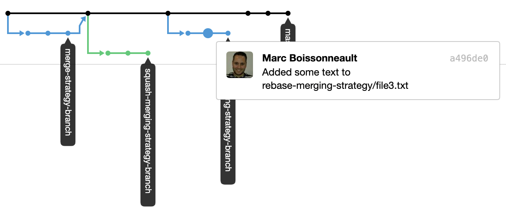

# github-merge-strategies

GitHub Merge strategies explained by examples

I used to had a lot of discussion around the right pull request merge strategy to adopt.  
I had a hard time to understand the exact behavior while looking at these github explainations of the merge strategies:

- [About merge methods on GitHub](https://help.github.com/en/articles/about-merge-methods-on-github)
- [About pull request merges](https://help.github.com/en/articles/about-pull-request-merges)

So I decided to experiment the 3 possibilities by myself in this repo!

## Experimentation procedure

For each of the 3 merge strategy proposed by github I repeated the following steps:  
1- Create a branch with the name of the strategy into it.  
_here are the 3 branches I've created:_

- _merge-strategy-branch_
- _squash-merging-strategy-branch_
- _rebase-merging-strategy-branch_

2- Create 3 commits  

- 1: Add a small text file in the _Specific Strategy_ folder (eg: `merge-strategy/file1.txt`)
- 2: Add some text to the file
- 3: Complete the sentence on the file

3- Create a PR to merge the branch on master  

- _merge-strategy-branch_: [PR](https://github.com/MarcBoissonneault/github-merge-strategies/pull/1)
- _squash-merging-strategy-branch_: [PR](https://github.com/MarcBoissonneault/github-merge-strategies/pull/2)
- _rebase-merging-strategy-branch_:  [PR](https://github.com/MarcBoissonneault/github-merge-strategies/pull/3)

4- Merge the PR with the strategy mentionned on the branch name.

## Resulting History

## Observations

### Merge commit

Merge commits strategy adds all commits from the branch to the base branch with a merge commit.  

_master merge commit:_  
  

<table>
    <tr font="bold">
        <th>Pros</th>
        <th>Cons</th>
    </tr>
    <tr>
        <td valign="top">
            <ul>
                <li>Commit History preserved
                    <ul><li>Commits not modified, SHA-1 are the same</li></ul>
                </li>
                <li>Explicitly shows when a merge happened = maintain context of a branch</li>
                <li>Complete feature revert is made easy with that single merge commit added to master.
                    <ul><li>But We can also only revert faulty commit, single one of a multi-commit feature</li></ul>
                </li>
            </ul>
        </td>
        <td valign="top">
            <ul>
                <li>Additional merge commit added to the master branch
                    <ul>
                        <li>merge commit made on behalf of the PR creator</li>
                    </ul>
                </li>
                <li>Visual history not easy to understand if number of branches gets high and live for a long period of time</li>
            </ul>
        </td>
    </tr>
</table>

### Squash merging

Squash merging strategy combines all commits from the branch into a single commit in the base branch.

**_Note: it the same as doing_**
  > git checkout master  
  > git pull  
  > git --squash merge branch  

_master squashed commit:_  
  

<table>
    <tr font="bold">
        <th>Pros</th>
        <th>Cons</th>
    </tr>
    <tr>
        <td valign="top">
            <ul>
                <li>Easy to see the whole unit of work in that single commit added to master</li>
                <li>Complete feature revert is made easy with that single squashed commit added to master</li>
                <li>Visual history of the master branch is linear</li>
            </ul>
        </td>
        <td valign="top">
            <ul>
                <li>Create a dead-end branch (nothing is telling that the branch is merged or not, at least visually)</li>
                <li>Lose information about when specific changes were originally made.</li>
            </ul>
        </td>
    </tr>
</table>

### Rebase merging

Rebase merging _recommit_ all commits from the branch onto the base branch individually.

_branch commit:_  
  

_master commit:_  
  

<table>
    <tr font="bold">
        <th>Pros</th>
        <th>Cons</th>
    </tr>
    <tr>
        <td valign="top">
            <ul>
                <li>Visual history of the master branch is linear</li>
                <li>Commit history is preserved dirrectly on master</li>
                <li>Can only revert faulty commit, single one of a multi-commit feature</li>
                <li>Force (at least psychologically) devs to write commit that don’t break master</li>
            </ul>
        </td>
        <td valign="top">
            <ul>
                <li>Replacement commits made to the master branch are made on behalf of the creator of those commits by GitHub (see note below)</li>
                <li>Create a dead-end branch (nothing is telling that the branch is merged or not, at least visually)</li>
                <li>More difficult to determine the content (group of commits) of a complete feature, when looking at master branch</li>
            </ul>
        </td>
    </tr>
</table>

> **_Note:_**  
> _The rebase and merge behavior on GitHub deviates slightly from git rebase._  
> 
> _Rebase and merge on GitHub will always update the committer information and create new commit SHAs, whereas git rebase outside of GitHub does not change the committer information when the rebase happens on top of an ancestor commit_  
>
> _source : https://help.github.com/en/articles/about-pull-request-merges#rebase-and-merge-your-pull-request-commits_  

_An issue is open on GitHub since we are losing commits signatures & verifications._  
_If your master branch rules prevent you from creating a **not-signed** commit, this strategy cannot be used_  

")

## Recommendations

- Commit early and often.
  - Small pieces mean easier code reviews, unit testing and better alignment to Single Responsibility Principle.
- As much as you can, try to keep a clear commit history
  - Fixup/squash useless commits (typo, fix linting issues or import sorting)
  - Write meaningful messages (title, details and a link to the originating issue)
- Rebase your branch on master _before_ creating and merging a PR
  - This ensures every merge commit is working and not breaking the build (no failing tests, no conflicting migrations)

## Final words

There is not "right" choice for the merging strategy. It's up to you to decide which one to use and to understand the pros and cons of the selected strategy.
